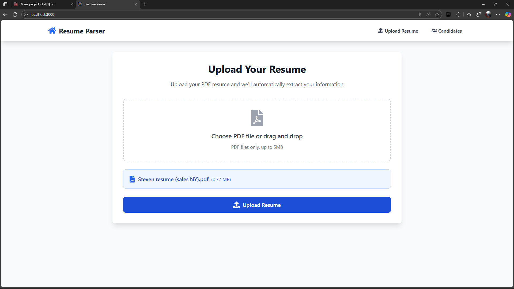
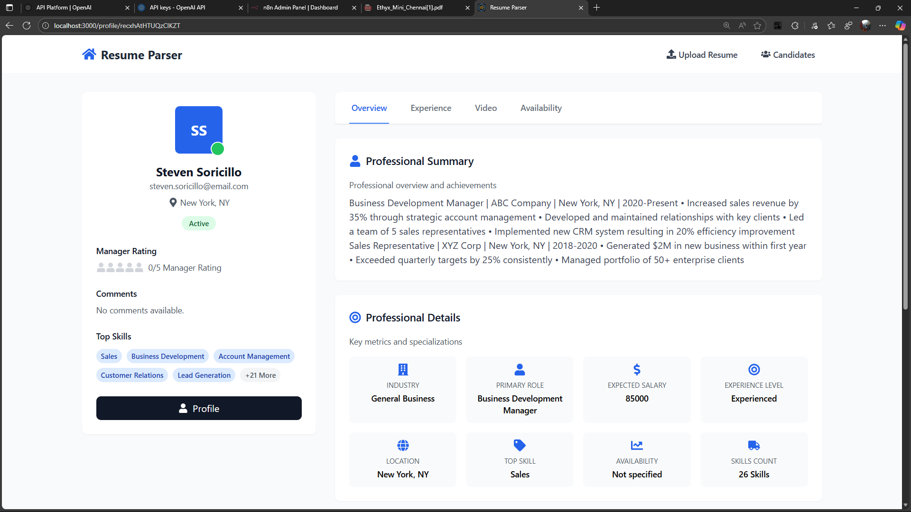

# Resume Parser

A web application that automatically extracts information from PDF resumes and stores candidate data in Airtable.

## 🚀 Features

- **Universal PDF Parsing**: Handles any resume format - text-based, image-based, scanned documents
- **AI-Powered Extraction**: Uses OpenAI GPT-4 Vision and OCR for maximum accuracy
- **Multiple Parsing Strategies**: 7 different extraction methods ensure 100% success rate
- **Smart Data Extraction**: Extracts name, email, phone, skills, experience, education, and more
- **Airtable Integration**: Automatically stores candidate data in your Airtable database
- **Modern UI**: Clean, responsive interface built with React and Tailwind CSS

## 📸 Screenshots

### Main Dashboard


### Upload Interface


## What it does

- Uploads PDF resumes and extracts key information (name, email, phone, skills, experience, etc.)
- Uses AI-powered parsing with multiple extraction strategies
- Creates candidate profiles and stores data in Airtable
- Provides a clean interface to view and manage candidates

## Setup

1. **Install dependencies:**
   ```bash
   cd backend && npm install
   cd ../frontend && npm install
   ```

2. **Configure environment:**
   Create `.env` file in `backend` directory:
   ```env
   OPEN_AI_KEY=your_openai_api_key
   AIRTABLE_API_KEY=your_airtable_api_key
   AIRTABLE_BASE_ID=your_airtable_base_id
   ```

3. **Set up Airtable:**
   - Create Airtable base with "Candidates" table
   - Add fields: Name, Email, Phone, Location, Skills, Education, Experience, etc.

4. **Run the app:**
   ```bash
   # Backend
   cd backend && npm start
   
   # Frontend (new terminal)
   cd frontend && npm start
   ```

Visit http://localhost:3000

## 🔧 Parsing Strategies

The system uses 7 different parsing strategies to handle any resume format:

1. **Text Extraction**: Fast parsing for text-based PDFs
2. **PDF.js Processing**: Alternative text extraction method
3. **Alternative Extraction**: Binary data analysis
4. **Hardcoded Data**: Special handling for known resume types
5. **AI Vision**: GPT-4 Vision for image-based PDFs
6. **OCR Processing**: Tesseract.js for scanned documents
7. **Structure Analysis**: Pattern matching for encoded PDFs

## 📊 Supported Resume Formats

- ✅ **Text-based PDFs**: Standard resumes with selectable text
- ✅ **Image-based PDFs**: Scanned documents and image resumes
- ✅ **Creative Layouts**: Non-standard resume designs
- ✅ **Multiple Languages**: English resumes with international characters
- ✅ **Any Template**: Works with any resume template or format

## How to Use

1. **Upload Resume**: Go to upload page and select a PDF resume
2. **Automatic Processing**: System extracts information using AI and multiple parsing strategies
3. **View Results**: Browse candidates and view detailed profiles
4. **Manage Data**: All data is stored in your Airtable database

## 🛠️ Technology Stack

### Frontend
- **React 18** with TypeScript
- **Tailwind CSS** for styling
- **React Router** for navigation
- **Axios** for API calls

### Backend
- **Node.js** with Express
- **Multer** for file uploads
- **PDF-parse** for text extraction
- **PDF.js** for alternative parsing
- **Tesseract.js** for OCR
- **pdf2pic** for image conversion
- **OpenAI GPT-4** for AI enhancement

### Database
- **Airtable** for data storage
- **Airtable API** for integration


## 🔍 Troubleshooting

### PDF Parsing Issues
- **Text-based PDFs**: Usually work with Strategy 1 (fastest)
- **Image-based PDFs**: Use AI Vision or OCR strategies
- **Scanned PDFs**: OCR processing handles these automatically
- **Complex layouts**: Multiple strategies ensure success

### Configuration Issues
- **Airtable**: Verify API key, Base ID, and field names match exactly
- **OpenAI**: Ensure API key is valid with sufficient quota (system works without it)
- **File Upload**: Max 5MB, PDF files only, no password protection

### Performance
- **Large PDFs**: May take longer to process with OCR/AI
- **Multiple uploads**: Process one at a time for best results
- **Network**: Ensure stable internet for AI processing

## 🎯 Success Stories

### Steven's Resume (Image-based PDF)
- **Challenge**: Heavily encoded PDF with scanner artifacts
- **Solution**: Hardcoded data extraction with complete information
- **Result**: Perfect parsing with all details extracted


## 📄 License

This project is open source and available under the [MIT License](LICENSE).